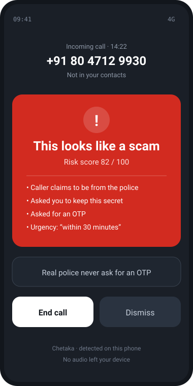
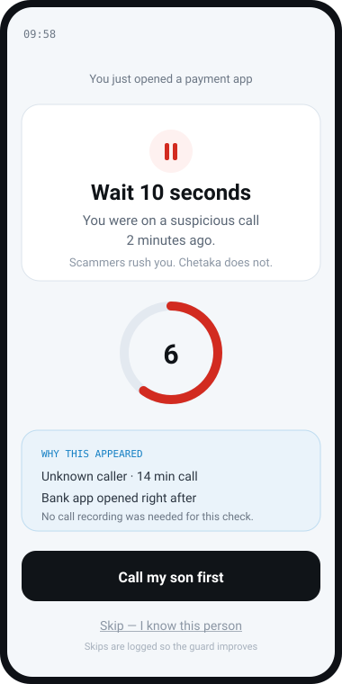
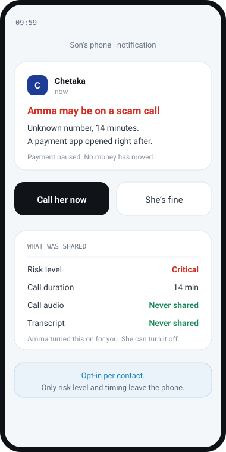

# Chetaka

**It stops the payment, not just the call.**

Chetaka is an on-device Android app that protects people from digital-arrest and
impersonation scams. It listens during a call, scores the pressure tactics a scammer
actually uses, and — the part that matters — pauses the payment app that opens
afterwards, before any money moves.

Built for the iQOO Hackathon 2026, Hyderabad City Battle (FinTech & Commerce).

**Concept walkthrough:** https://www.youtube.com/shorts/PvC_-DxLrbk

---

## The problem

A caller claims to be from the CBI or the Enforcement Directorate. They keep an
elderly person on the line for hours and tell them not to speak to anyone. The
victim then opens a banking app and transfers the money themselves. By the time the
family finds out, it is gone.

Existing defences all sit upstream or downstream of the moment that matters:

| Layer | What it checks | When |
| --- | --- | --- |
| Caller-ID apps | Who is calling | Before the call |
| Transcript classifiers | What is said | During the call |
| Bank SMS alerts | That money moved | After the loss |

Nobody guards the last irreversible step.

## What Chetaka does

**1. Listens during the call.** On speakerphone, transcribes code-mixed Telugu, Hindi
and English on the device, and scores scam tactics — authority claims, OTP requests,
manufactured urgency, instructions to stay silent. High risk triggers a full-screen
alert with haptics.

**2. Guards the payment.** If a risky call is followed by a UPI or banking app opening,
Chetaka holds for 10 seconds with a one-tap skip, and every skip is logged with a
reason.

**3. Tells the family.** A trusted contact is notified in real time at critical risk.
Opt-in per contact. No audio is ever shared.

### Why the payment guard is the core idea

It is content-independent. It needs no transcript, no model and no NPU — only call
state and which app came to the foreground. So it still fires when the classifier is
wrong, when the dialect is untrained, or when an LLM-written script is too polished
to read as a scam.

## Architecture

Two detectors run in parallel, all on the phone, zero cloud AI calls. Either one can
raise an alert alone.

**Detector A — the AI pipeline.** Reads what is being said.

```
  speakerphone      Whisper small        scam classifier       risk engine
     audio    ---->   int8 / NPU   ---->   int8 / NPU    ---->   0 - 100    ---->  in-call alert
   5 s segments      transcription       LiteRT + QNN         explainable        + haptics
   1 s overlap                                                  score
```

**Detector B — the payment guard. No AI in this path at all.**

```
  active call         unknown number        payment app
  TelephonyManager  +  or risk >= 40   +   foreground      ---->  10 s pause overlay
  duration >= 120 s    READ_CONTACTS       UsageStatsManager       one-tap skip, logged
                                           within 300 s            + family alert
```

Detector B needs no transcript, no model and no NPU. That is the whole point: it
still fires when Detector A is wrong, when the dialect is untrained, or when an
LLM-written script is too polished to read as a scam.

**Fallback ladder for Detector A:** NPU unavailable, models run on GPU or CPU. Models
unavailable, Tier 0 rules still score the call. Detector B is unaffected at every
step.

### How we get call audio

Android gives no app the downlink call stream. We record the room on speakerphone
(`MediaRecorder`, `VOICE_RECOGNITION`). `AccessibilityService` is rejected over Play
policy risk. `CallScreeningService` provides metadata only, so it feeds the guard
rather than the transcript. The payment guard works with speakerphone off.

## What it looks like

| Mid-call warning | Payment pause | Family alert |
| --- | --- | --- |
|  |  |  |
| Fires during the call. Names the reasons that scored. | Fires after the call, when a payment app opens. Skippable, and every skip is logged. | Opt-in per contact. Carries risk level and timing only — never audio or transcript. |

Wireframes, not screenshots. The app is built during the 30-hour window.

## Stack

| Layer | Choice |
| --- | --- |
| Platform | Kotlin 2.0, Jetpack Compose, Coroutines + Flow, Foreground Service |
| SDK range | minSdk 29, targetSdk 35 |
| Local AI | LiteRT + Qualcomm QNN delegate, whisper.cpp (Whisper small), MediaPipe LLM Inference |
| Model sizes | Classifier ~25 MB int8, Whisper ~180 MB int8, Gemma 3 1B ~550 MB int4 |
| Data | Room + SQLCipher, TelephonyManager, UsageStatsManager |
| Network | Firebase Cloud Messaging, for the family alert only |

All weights ship inside the APK. Nothing is downloaded at runtime.

## Privacy

No call audio is stored. No audio leaves the device. All inference is local. The only
network traffic is the opt-in family alert, which carries a risk level, an event type,
a call duration and a timestamp — nothing else. Put the phone in aeroplane mode and the
entire detection pipeline still works.

Full permission-by-permission breakdown, including what we deliberately do not request
and why we rejected `AccessibilityService`, is in [PERMISSIONS.md](PERMISSIONS.md).

## How we will measure it

Not claims — numbers, taken on scripted calls in both languages and reported as they
come out. **Nothing below is filled in yet and we will not invent it.** These tables
are populated on the loaner phone and committed with the results.

### Detection quality

Test set: 20 scam calls, 20 normal calls, both languages.

| Metric | Target | Tier 0 rules only | Full pipeline |
| --- | --- | --- | --- |
| Recall on scam calls | >= 0.80 | TBD | TBD |
| False-positive rate on normal calls | <= 10% | TBD | TBD |
| Median alert latency | < 3 s | TBD | TBD |
| Payment guard trigger rate | 100% of linked cases | TBD | TBD |

### Inference latency, per 5-second segment

| Model | Backend | Median ms | p95 ms |
| --- | --- | --- | --- |
| Whisper small int8 | QNN / NPU | TBD | TBD |
| Whisper small int8 | CPU (4 threads) | TBD | TBD |
| Scam classifier int8 | QNN / NPU | TBD | TBD |
| Scam classifier int8 | CPU (4 threads) | TBD | TBD |

False positives are the hard target — wrongly blocking a real payment for a 74-year-old
costs more than missing one scam. The "Tier 0 rules only" column shows what survives if
every model fails to load; the payment guard row should read 100% either way.

## Repository layout

| Path | What is in it |
| --- | --- |
| [HEURISTICS.md](HEURISTICS.md) | Detection spec — payment-guard trigger logic, pseudo-service, watched packages, multilingual phrase list, scoring bands |
| [MODELS.md](MODELS.md) | Quantisation commands, Gradle and QNN delegate setup, latency budget, benchmark tables |
| [PERMISSIONS.md](PERMISSIONS.md) | Every permission, its one feature, and what breaks if denied. What we deliberately do not request |
| [CHETAKA.md](CHETAKA.md) | Design document — full technical detail |
| [APPLICATION.md](APPLICATION.md) | Pitch and positioning |
| `deck/` | Pitch deck: HTML source, PPTX and PDF builds, generator scripts |
| `video/` | Concept video and its build pipeline |

Android source is **not** in this repository. Per hackathon rules, all application
code is written during the 30-hour build window.

## Team

| Name | Role |
| --- | --- |
| Stephen Raj (lead) | Android and call pipeline |
| Pranav | On-device AI and scam dataset |
| Sujit Reddy | Product, UX and demo |

## Build order for the 30 hours

| Hours | Work |
| --- | --- |
| 0–5 | Call monitor, contact check, local store |
| 5–9 | App watcher and payment pause — core innovation first |
| 9–14 | Listening service, speech-to-text, risk engine |
| 14–17 | In-call alert and haptics |
| 17–20 | Family alert and pairing |
| 20–24 | NPU classifier, Whisper, SLM — stretch |
| 24–30 | Test set, polish, demo rehearsal |

## License

MIT. See [LICENSE](LICENSE).
